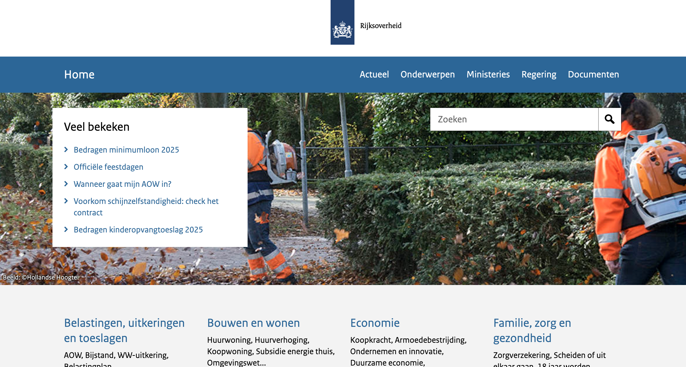
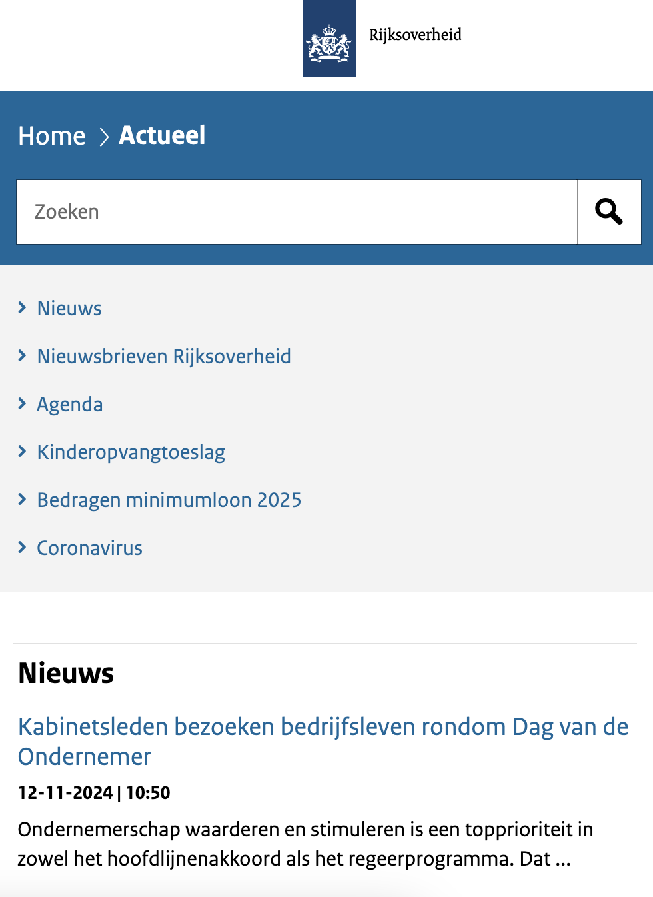

## Procesverslag van Milo Raven (500840804)

## Dit ben ik

  
Klik hier om meer over mij te lezen

  ### Auteur:
  Milo Raven

  ### Je startniveau:
  Rood

  ### Je focus:
  Responsive
 

## Mijn website

  
Klik hier om meer te lezen over de opdracht

  ### Mijn opdracht:
  Het namaken van de website van de Rijkoverheid:
  https://www.rijksoverheid.nl/
  #### Screenshot(s) van de eerste pagina (small screen): 
  Homepagina van de Rijksoverheid:

  

  #### Screenshot(s) van de tweede pagina (small screen):
  Actueelpagina van de Rijksoverheid:

  
 

## Toegankelijkheidstest 1/2 (week 1)

  
Klik hier om meer te lezen over de eerste toegankelijkheidstest

 # Toegankelijkheidstest van Rijksoverheid.nl

## Inleiding
Ik heb een toegankelijkheidstest uitgevoerd op de website Rijksoverheid.nl. Het doel van de test was om te beoordelen hoe goed de website werkt voor verschillende doelgroepen, zoals mensen die afhankelijk zijn van een screenreader, mensen met kleurenblindheid, en gebruikers die specifieke visuele en bewegingsinstellingen nodig hebben. Daarnaast heb ik de website vergeleken met Tiptopwasenstrijkservice.nl om een breder perspectief te krijgen op toegankelijkheid. In deze README staan mijn bevindingen en aanbevelingen.

## Bevindingen van de voiceovertest
Ik heb getest hoe een screenreader de website voorleest. Hierbij keek ik naar de structuur, navigatie en labels van interactieve elementen.

De koppenstructuur van de website is duidelijk en logisch. De belangrijkste onderdelen, zoals "Veel bekeken" en het menu, worden correct aangekondigd door de screenreader. Door het gebruik van ARIA-landmarks, zoals `role="main"` en `role="navigation"`, kan ik eenvoudig naar verschillende secties springen, zoals de navigatiebalk en de hoofdinhoud.

De knoppen en links hebben duidelijke en beschrijvende labels, bijvoorbeeld "Bedragen kinderopvangtoeslag 2025", waardoor ik direct begrijp wat ik kan verwachten. Ook de zoekbalk en andere formulieren werken goed, omdat deze correct gelabeld zijn.

De website scoort hoog op toegankelijkheid voor screenreaders. Dankzij de ARIA-landmarks en goede structuur kan ik de site eenvoudig gebruiken. Een kleine verbetering zou zijn om foutmeldingen in formulieren iets gedetailleerder te maken, zodat gebruikers meteen weten wat 

## WCAG checklist
Ik heb de WCAG-checklist twee keer ingevuld: één keer voor Rijksoverheid.nl en één keer voor Tiptopwasenstrijkservice.nl. Dit gaf me een goed beeld van hoe deze websites presteren op het gebied van toegankelijkheid.

Rijksoverheid.nl voldoet aan bijna alle richtlijnen in de checklist. De website heeft een sterke structuur, goed contrast en beschrijvende labels. Daarentegen scoorde Tiptopwasenstrijkservice.nl op veel punten slecht. De website mist een logische koppenstructuur, heeft slecht contrast en gebruikt geen correcte HTML-elementen. Dit benadrukt hoe belangrijk het is om toegankelijkheid vanaf het begin in het ontwerpproces mee te nemen.

## Kleurenblindtest
Ik heb getest hoe de website eruitziet voor mensen met Protanopia (roodblindheid), Deuteranopia (groenblindheid), Tritanopia (blauwblindheid) en Achromatopsia (volledige kleurenblindheid).

Bij Protanopia en Deuteranopia zijn rode en groene tinten moeilijk te onderscheiden. Het blauwe menu blijft duidelijk zichtbaar, maar als ik bijvoorbeeld een rode accentkleur zou gebruiken, is die niet te zien. Bij Tritanopia verdwijnen blauwe tinten, wat het menu minder opvallend maakt. Bij Achromatopsia is alles grijs, en zonder extra visuele cues, zoals onderstreping of iconen, zijn links moeilijk te herkennen.

De website werkt redelijk goed voor kleurenblinde gebruikers, maar kan verbeteren door meer visuele elementen toe te voegen, zoals iconen naast kleur of onderstreping bij links.

## Dark/lighttest, increase contrast en reduce motion test
Ik heb gekeken hoe de website reageert op instellingen zoals donkere modus, verhoogd contrast en het verminderen van bewegingseffecten.

De website reageert niet op deze instellingen. Wanneer ik de donkere modus inschakel, verandert er niets aan de kleuren. Ook bij verhoogd contrast gebeurt er niets. Bij reduce motion blijven animaties of bewegingen hetzelfde.

Hier is veel ruimte voor verbetering. Door de website aan te passen aan deze gebruikersvoorkeuren kan de ervaring voor visueel beperkte gebruikers en mensen met gevoeligheid voor beweging flink verbeteren.

## Conclusie en ontwerpadvies
Ik vind dat Rijksoverheid.nl een goede basis heeft voor toegankelijkheid, vooral bij het gebruik van screenreaders en de algemene structuur. Toch zijn er verbeterpunten, vooral op het gebied van kleur en gebruikersvoorkeuren.

1. **Kleurgebruik:** Voeg meer visuele elementen toe, zoals onderstreping bij links en iconen naast kleurgecodeerde knoppen.
2. **Dark mode:** Implementeer een donkere modus voor visueel comfort in omgevingen met weinig licht.
3. **Contrast:** Zorg dat de website reageert op verhoogde contrastinstellingen om de leesbaarheid te verbeteren.
4. **Reduce motion:** Voeg ondersteuning toe om animaties te minimaliseren of uit te schakelen voor mensen die gevoelig zijn voor beweging.
5. **Formulieren:** Maak foutmeldingen gedetailleerder en geef duidelijke instructies, zoals "Gebruik alleen cijfers bij het invullen van dit veld."

Door deze verbeteringen kan de website niet alleen voldoen aan de richtlijnen, maar ook een inclusieve ervaring bieden aan een breder publiek.

## Breakdownschets (week 1)

  
uitwerken na afloop 3e werkgroep

  ### de hele pagina: 
  

  ### dynamisch deel (bijv menu): 
  

  ### wellicht nog een dynamisch deel (bijv filter): 
  

## Voortgang 1 (week 2)

  
uitwerken voor 1e voortgang

  ### Stand van zaken
  hier dit ging goed & dit was lastig (neem ook screenshots op van delen van je website en code)

  ### Agenda voor meeting
  samen met je groepje opstellen

  | student 1      | student 2          | student 3    | student 4        |
  | ---            | ---                | ---          | ---              |
  | dit bespreken  | en dit             | en ik dit    | en dan ik dat    |
  | en dat ook nog | dit als er tijd is | nog een punt | dit wil ik zeker |
  | ...            | ...                | ...          | ...              |

  ### Verslag van meeting
  hier na afloop snel de uitkomsten van de meeting vastleggen

  - punt 1
  - punt 2
  - nog een punt
  - ...

## Voortgang 2 (week 3)

  
uitwerken voor 2e voortgang

  ### Stand van zaken
  hier dit ging goed & dit was lastig (neem ook screenshots op van delen van je website en code)

  ### Agenda voor meeting
  samen met je groepje opstellen

  | student 1      | student 2          | student 3    | student 4        |
  | ---            | ---                | ---          | ---              |
  | dit bespreken  | en dit             | en ik dit    | en dan ik dat    |
  | en dat ook nog | dit als er tijd is | nog een punt | dit wil ik zeker |
  | ...            | ...                | ...          | ...              |

  ### Verslag van meeting
  hier na afloop snel de uitkomsten van de meeting vastleggen

  - punt 1
  - punt 2
  - nog een punt
- ...

## Toegankelijkheidstest 2/2 (week 4)

  
uitwerken na test in 9e werkgroep

  ### Bevindingen
  Lijst met je bevindingen die in de test naar voren kwamen (geef ook aan wat er verbeterd is):

## Voortgang 3 (week 4)

  
uitwerken voor 3e voortgang

  ### Stand van zaken
  hier dit ging goed & dit was lastig (neem ook screenshots op van delen van je website en code)

  ### Agenda voor meeting
  samen met je groepje opstellen

  | student 1      | student 2          | student 3    | student 4        |
  | ---            | ---                | ---          | ---              |
  | dit bespreken  | en dit             | en ik dit    | en dan ik dat    |
  | en dat ook nog | dit als er tijd is | nog een punt | dit wil ik zeker |
  | ...            | ...                | ...          | ...              |

  ### Verslag van meeting
  hier na afloop snel de uitkomsten van de meeting vastleggen

  - punt 1
  - punt 2
  - nog een punt
  - ...

## Eindgesprek (week 5)

  
uitwerken voor eindgesprek

  ### Je uitkomst - karakteristiek screenshots:
  

  ### Dit ging goed/Heb ik geleerd: 
  Korte omschrijving met plaatjes

  

  ### Dit was lastig/Is niet gelukt:
  Korte omschrijving met plaatjes

  

## Bronnenlijst

  
Klik hierop om alle gebruikte bronnen te bekijken

  1. Bron 1
  Favicon van het logo van de Rijksoverheid:
  https://www.radiotherapiegroep.nl/rijksoverheid-logo/
  2. Bron 2
  Logo van de Rijksoverheid voor de header met een transparante achtergrond:
  https://www.rijkshuisstijl.nl/publiek/modules/product/DigitalStyleGuide/default/index.aspx?ItemId=6775
  3. ...

