## Procesverslag van Milo Raven (500840804)

## Dit ben ik

Klik hier om meer over mij te lezen

### Auteur:

Milo Raven

### Je startniveau:

Rood

### Je focus:

Responsive

## Mijn website

Klik hier om meer te lezen over de opdracht

### Mijn opdracht:

Het namaken van de website van de Rijkoverheid: https://www.rijksoverheid.nl/.

#### Screenshot(s) van de eerste pagina (small screen): 

Homepagina van de Rijksoverheid:

#### Screenshot(s) van de tweede pagina (small screen):

Actueelpagina van de Rijksoverheid:

## Toegankelijkheidstest 1/2 (week 1)

Klik hier om meer te lezen over de eerste toegankelijkheidstest

### Inleiding

Ik heb een toegankelijkheidstest uitgevoerd op de website Rijksoverheid.nl. Het doel van de test was om te beoordelen hoe goed de website werkt voor verschillende doelgroepen, zoals mensen die afhankelijk zijn van een screenreader, mensen met kleurenblindheid, en gebruikers die specifieke visuele en bewegingsinstellingen nodig hebben. Daarnaast heb ik de website vergeleken met Tiptopwasenstrijkservice.nl om een breder perspectief te krijgen op toegankelijkheid. In deze README staan mijn bevindingen en aanbevelingen.

### Bevindingen van de voiceovertest

Ik heb getest hoe een screenreader de website voorleest. Hierbij keek ik naar de structuur, navigatie en labels van interactieve elementen.

De koppenstructuur van de website is duidelijk en logisch. De belangrijkste onderdelen, zoals "Veel bekeken" en het menu, worden correct aangekondigd door de screenreader. Door het gebruik van ARIA-landmarks, zoals `role="main"` en `role="navigation"`, kan ik eenvoudig naar verschillende secties springen, zoals de navigatiebalk en de hoofdinhoud.

De knoppen en links hebben duidelijke en beschrijvende labels, bijvoorbeeld "Bedragen kinderopvangtoeslag 2025", waardoor ik direct begrijp wat ik kan verwachten. Ook de zoekbalk en andere formulieren werken goed, omdat deze correct gelabeld zijn.

De website scoort hoog op toegankelijkheid voor screenreaders. Dankzij de ARIA-landmarks en goede structuur kan ik de site eenvoudig gebruiken. Een kleine verbetering zou zijn om foutmeldingen in formulieren iets gedetailleerder te maken, zodat gebruikers meteen weten wat ze moeten corrigeren.

### WCAG checklist

Ik heb de WCAG-checklist twee keer ingevuld: één keer voor Rijksoverheid.nl en één keer voor Tiptopwasenstrijkservice.nl. Dit gaf me een goed beeld van hoe deze websites presteren op het gebied van toegankelijkheid.

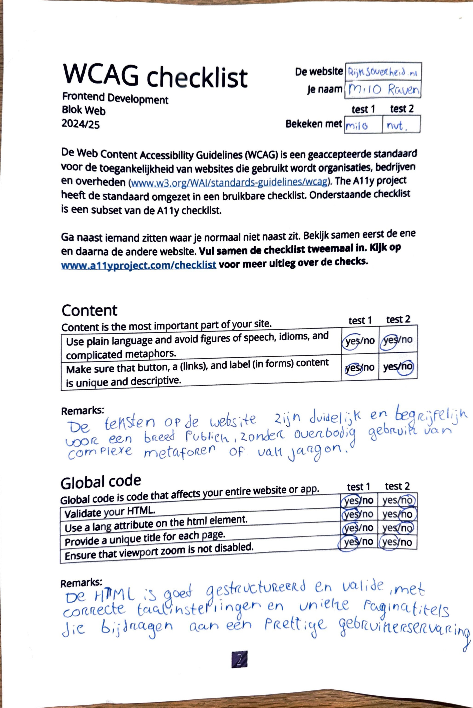

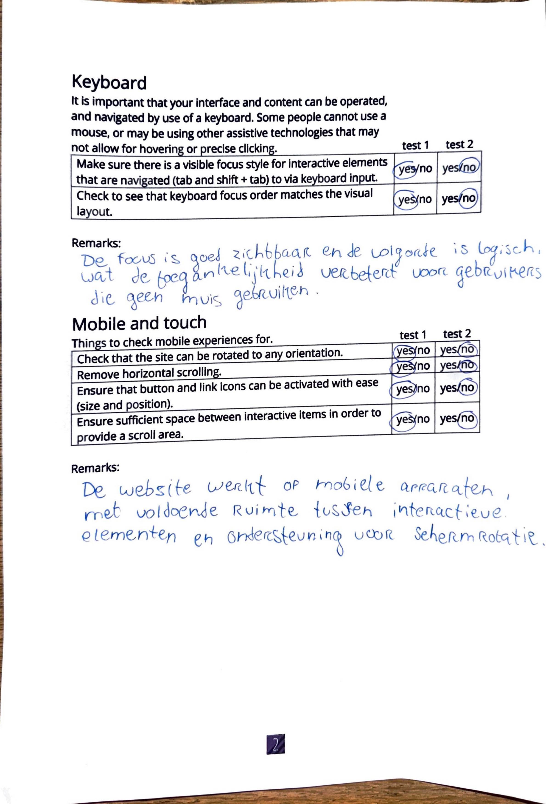

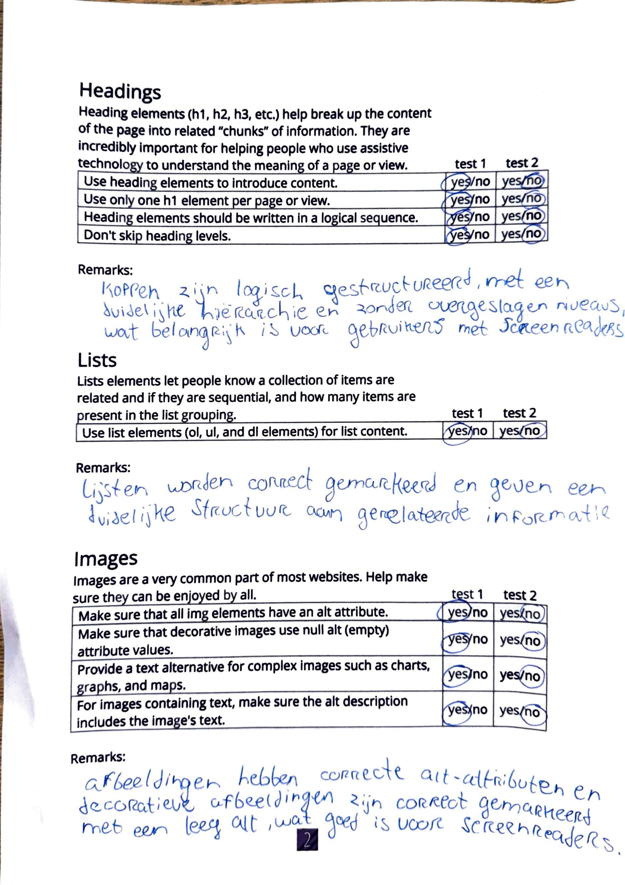

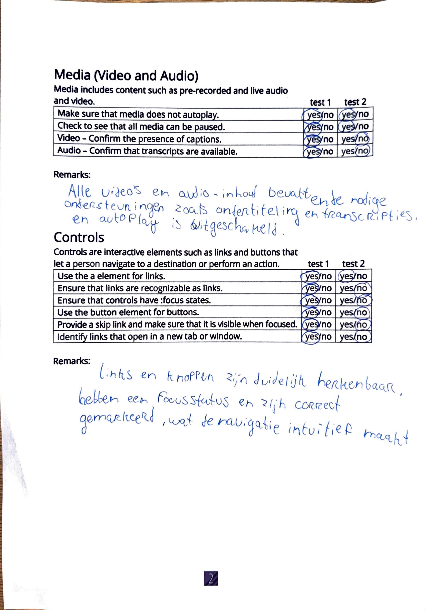

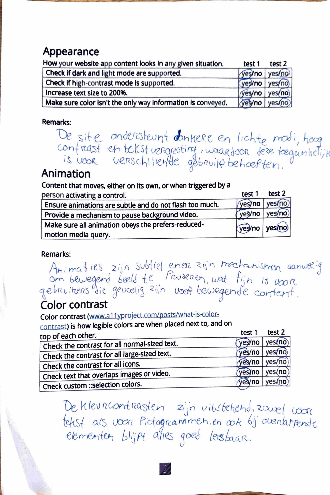

Rijksoverheid.nl voldoet aan bijna alle richtlijnen in de checklist. De website heeft een sterke structuur, goed contrast en beschrijvende labels. Daarentegen scoorde Tiptopwasenstrijkservice.nl op veel punten slecht. De website mist een logische koppenstructuur, heeft slecht contrast en gebruikt geen correcte HTML-elementen. Dit benadrukt hoe belangrijk het is om toegankelijkheid vanaf het begin in het ontwerpproces mee te nemen.

### Kleurenblindtest
Ik heb getest hoe de website eruitziet voor mensen met Protanopia (roodblindheid), Deuteranopia (groenblindheid), Tritanopia (blauwblindheid) en Achromatopsia (volledige kleurenblindheid).

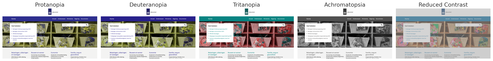

Bij Protanopia en Deuteranopia zijn rode en groene tinten moeilijk te onderscheiden. Het blauwe menu blijft duidelijk zichtbaar, maar als ik bijvoorbeeld een rode accentkleur zou gebruiken, is die niet te zien. Bij Tritanopia verdwijnen blauwe tinten, wat het menu minder opvallend maakt. Bij Achromatopsia is alles grijs, en zonder extra visuele cues, zoals onderstreping of iconen, zijn links moeilijk te herkennen.

De website werkt redelijk goed voor kleurenblinde gebruikers, maar kan verbeteren door meer visuele elementen toe te voegen, zoals iconen naast kleur of onderstreping bij links.

### Dark/lighttest, increase contrast en reduce motion test

Ik heb gekeken hoe de website reageert op instellingen zoals donkere modus, verhoogd contrast en het verminderen van bewegingseffecten.

De website reageert niet op deze instellingen. Wanneer ik de donkere modus inschakel, verandert er niets aan de kleuren. Ook bij verhoogd contrast gebeurt er niets. Bij reduce motion blijven animaties of bewegingen hetzelfde.

Hier is veel ruimte voor verbetering. Door de website aan te passen aan deze gebruikersvoorkeuren kan de ervaring voor visueel beperkte gebruikers en mensen met gevoeligheid voor beweging flink verbeteren.

### Conclusie en ontwerpadvies

Ik vind dat Rijksoverheid.nl een goede basis heeft voor toegankelijkheid, vooral bij het gebruik van screenreaders en de algemene structuur. Toch zijn er verbeterpunten, vooral op het gebied van kleur en gebruikersvoorkeuren.

1. **Kleurgebruik:** Voeg meer visuele elementen toe, zoals onderstreping bij links en iconen naast kleurgecodeerde knoppen.
2. **Dark mode:** Implementeer een donkere modus voor visueel comfort in omgevingen met weinig licht.
3. **Contrast:** Zorg dat de website reageert op verhoogde contrastinstellingen om de leesbaarheid te verbeteren.
4. **Reduce motion:** Voeg ondersteuning toe om animaties te minimaliseren of uit te schakelen voor mensen die gevoelig zijn voor beweging.
5. **Formulieren:** Maak foutmeldingen gedetailleerder en geef duidelijke instructies, zoals "Gebruik alleen cijfers bij het invullen van dit veld."

Door deze verbeteringen kan de website niet alleen voldoen aan de richtlijnen, maar ook een inclusieve ervaring bieden aan een breder publiek.

## Breakdownschets (week 1)

Klik hier om mijn breakdownschets te bekijken

### Breakdown van de twee pagina's: 

De breakdown van de twee pagina's:

### Dynamisch deel: 

De breakdown van een dynamisch deel:

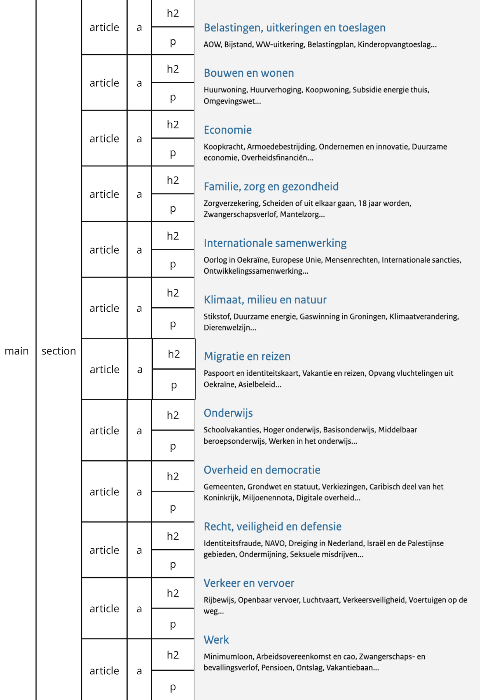

### Nog een dynamisch deel: 

De breakdown van nog een dynamisch deel:

## Voortgang 1 (week 2)

Klik hier om meer te weten lezen over het 1e voortgangsgesprek

### Stand van zaken

Het proces verloopt soepel. Helaas kon ik vanwege privéredenen en het vinden van een stage niet altijd bij de lessen aanwezig zijn, maar uiteindelijk is alles goed gekomen. De HTML is volledig afgerond en het procesverslag is up-to-date in de README-file. Daarnaast ben ik ook al begonnen met het experimenteren in CSS om verdere vooruitgang te boeken.

De website en een deel van de code:

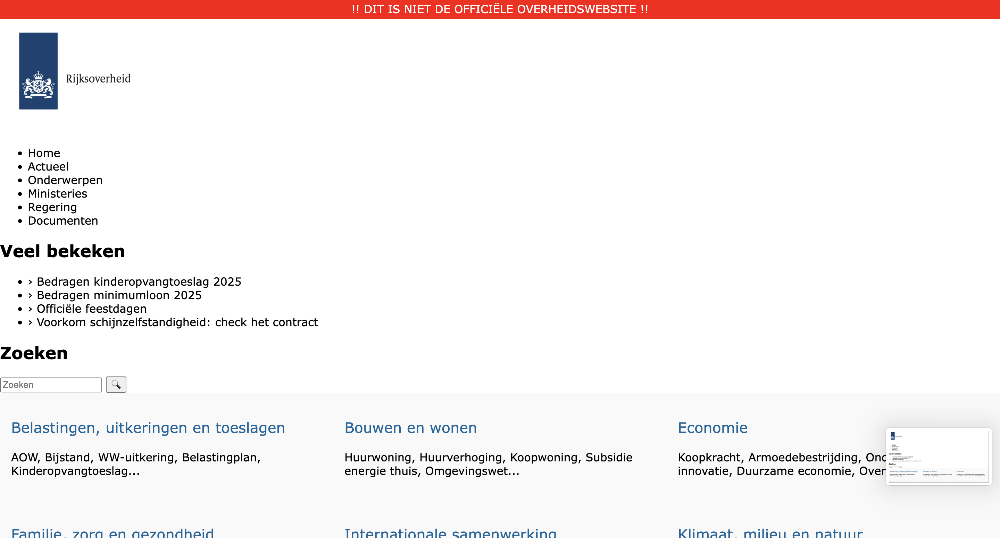

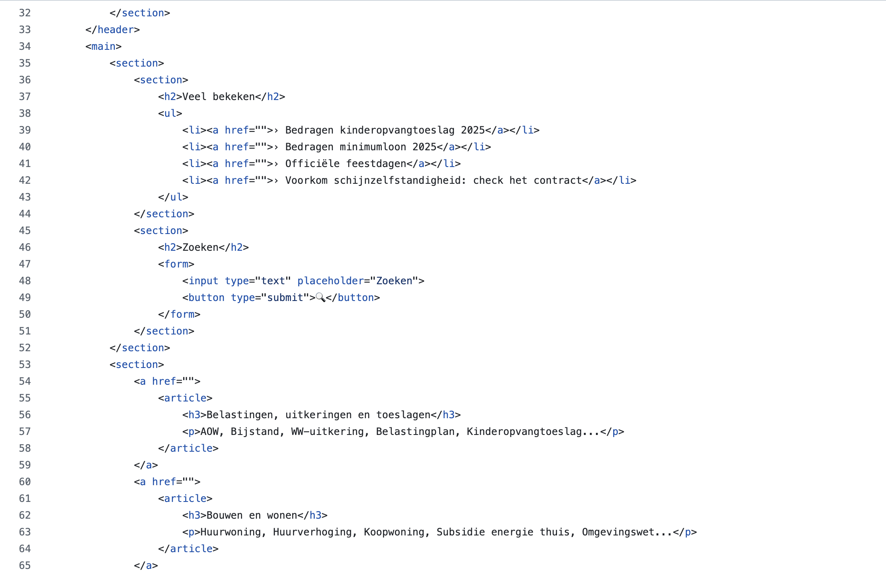

### Agenda voor meeting

Tijdens de groepssessie hebben we de agenda gericht op het verbeteren van CSS en het bespreken van individuele uitdagingen. Dit gaf ons de mogelijkheid om van elkaar te leren en concrete verbeterpunten te vinden. Het was waardevol om te zien hoe iedereen zijn eigen inzichten inbracht en oplossingen aandroeg.

### Verslag van meeting

We hebben concrete verbeteringen besproken, zoals het optimaliseren van sections (geen sections binnen sections), en het gebruik van H2-tags bij onduidelijke onderdelen, eventueel met onzichtbare H2's of aria-labels voor betere toegankelijkheid met screenreaders. Verder is het belangrijk om een eigen font te kiezen en niet te blijven bij standaardfonts zoals Verdana. Voor de structuur van artikelen werd geadviseerd om een lijst te maken, zodat screenreaders het aantal items duidelijk kunnen lezen. Tot slot hebben we besproken om bij media queries eerst voor mobiel te ontwerpen en vanuit daar verder te bouwen, waarbij we niet gebonden blijven aan specifieke schermformaten maar kijken naar wat visueel goed werkt.

## Voortgang 2 (week 3)

Klik hier om meer te lezen over het 2e voortgangsgesprek

### Stand van zaken

Tijdens dit gesprek waren we slechts met zijn tweeën, maar dat heeft me niet tegengehouden om veel te leren. Ik liep vast met het responsive maken van mijn header. In de les heeft Sanne dit duidelijk uitgelegd en zelfs de code hiervoor opgestuurd. Dit heeft enorm geholpen, en ik denk dat mijn project nu zo goed als klaar is.

Helina was al bijna klaar met haar project, omdat ze haar gesprek eerder gepland had. Dat gaf me de kans om veel inspiratie uit haar werk te halen en inzicht te krijgen in hoe ik mijn project verder kon verbeteren. Dit vond ik erg waardevol.

### Vooruitgang

Dankzij de hulp van Sanne en de inspiratie van Helina ben ik flink vooruitgegaan. De header is nu volledig responsive, en ik heb geleerd hoe ik mijn CSS efficiënter kan maken. Dit zal ik ook toepassen op andere delen van mijn project. Daarnaast heb ik de README verder bijgewerkt met de laatste wijzigingen.

Een screenshot van de responsive header op mobiel en desktop:

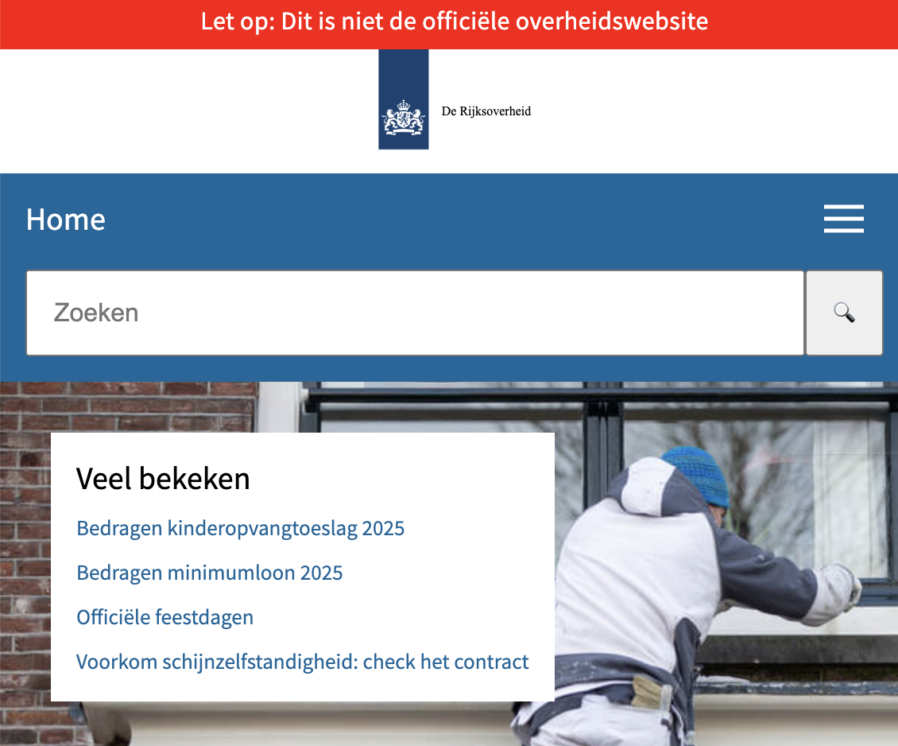

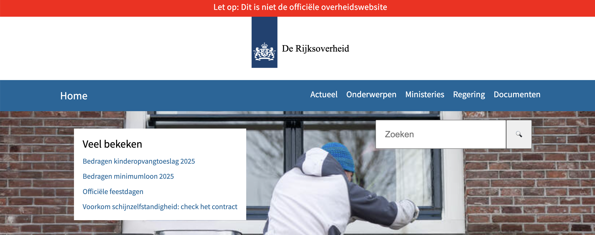

### Belangrijke inzichten

1. **Responsive header:** Het probleem dat heel moeilijk was leek na een uitleg ineens heel makkelijk. Ik heb hier echt zoveel aan gehad. 
2. **Feedback van Helina:** Haar gestructureerde aanpak inspireerde me om mijn project overzichtelijker te maken en me beter te focussen op toegankelijkheid.

### Agenda voor de volgende stappen

- Toepassen van de verbeteringen uit deze sessie op andere onderdelen van de website.
- Testen van de toegankelijkheid van de site met een screenreader.
- Beginnen met het schrijven van het definitieve procesverslag en voorbereiden op het laatste voortgangsgesprek.

## Toegankelijkheidstest 2/2 (week 4)

Klik hier om de bevindingen van de 2e toegankelijksheidstest te zien

### Bevindingen
Lijst met je bevindingen die in de test naar voren kwamen:

#### Screenreader
Alles werd goed toegelicht door de screenreader.

Ik gebruik nog te veel onnodige secties, wat de structuur verwarrend maakt. Dit moet worden vereenvoudigd om het toegankelijker te maken.

Op mijn tweede pagina ontbreken onzichtbare headers, waardoor je niet altijd weet waar je je bevindt. Dit moet worden toegevoegd.

Over het gebruik van `tabindex` ben ik nog onzeker. Hiervoor wil ik advies vragen aan mijn klasgenoten.

#### Contrast-check
**Light-modus**:

De contrast-check vond ik leuk om te doen en ik heb de website [WebAIM Contrast Checker](https://webaim.org/resources/contrastchecker/) gebruikt.

Voor de light-versie van mijn site voldoet alles aan WCAG AA voor normale tekst en aan WCAG AAA voor grote tekst en andere elementen.

**Dark-modus**:

Voor de dark-modus is alles goedgekeurd, inclusief WCAG AAA.

#### WCAG checklist

Ik heb de WCAG-checklist ook ingevuld. Veel viel er niet te verbeteren aan de website zelf. Ik heb een dark modus toegevoegd en wat ARIA-labels. Daaruit is geblekeken dat de website wel toegankelijker is geworden wat erg fijn is. 

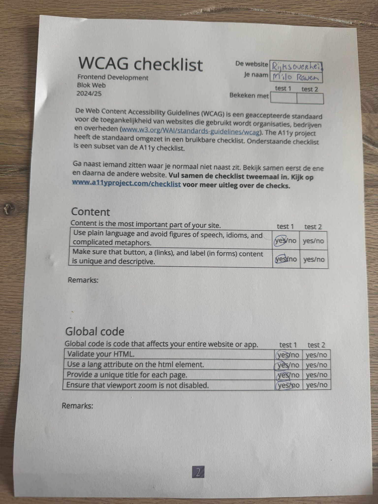

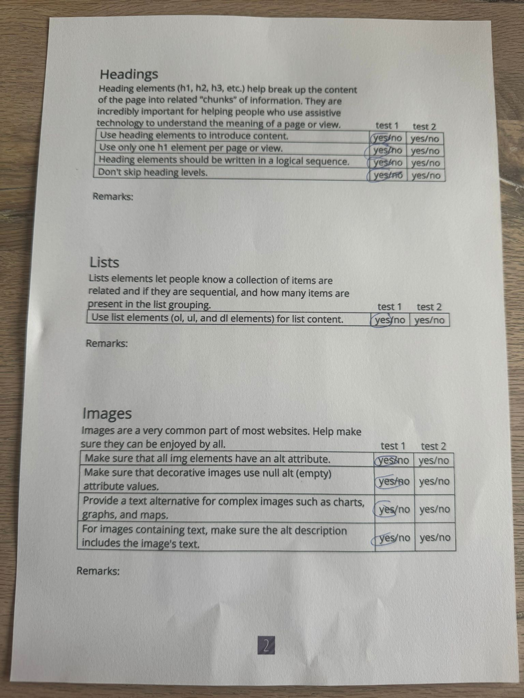

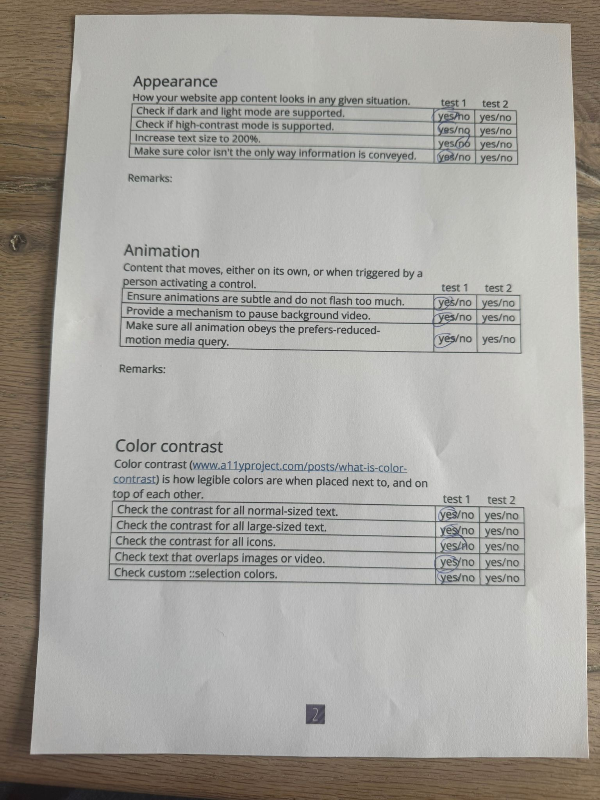

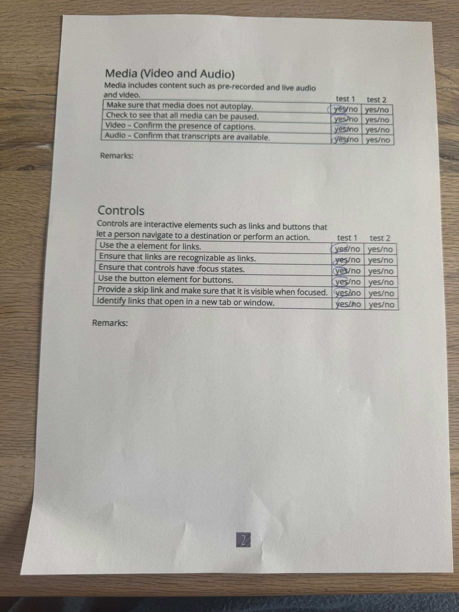

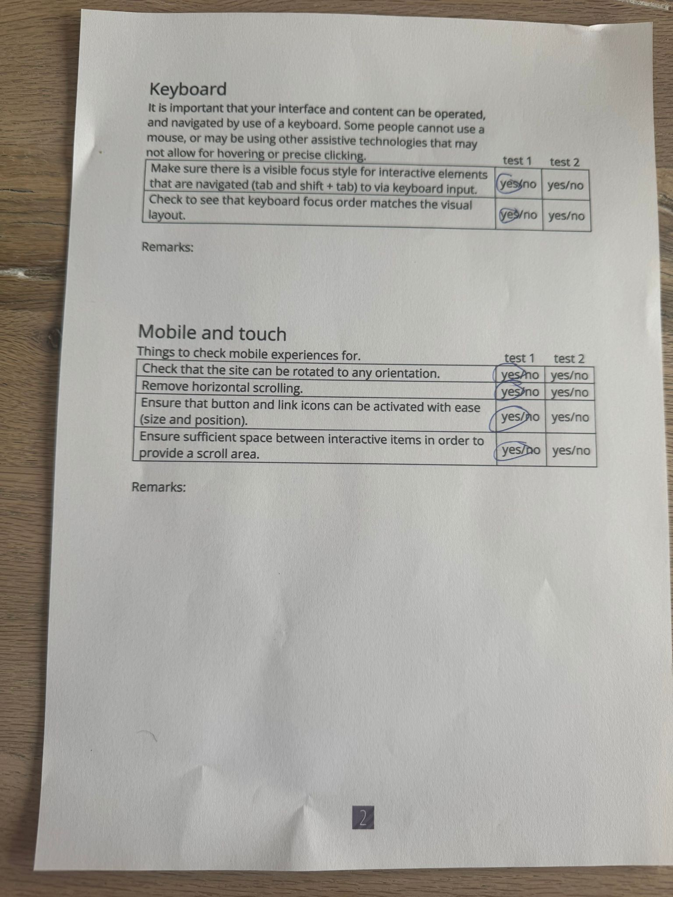

## Voortgang 3 (week 4)

  
Klik hier om meer te lezen over het 3e eindgesprek

  ### Stand van zaken

  Het derde gesprek was eigenlijk een eindgesprek. Omdat ik een voortgangsgesprek had gemist, werd dit gesprek ook benut om terug te kijken. Waar anderen soms gespannen waren, voelde ik me best relaxt. Ik kon nog veel vragen stellen, wat me nuttige inzichten gaf over hoe ik de laatste fase kan benaderen.

  Ik heb al een groot deel afgerond, maar er zijn nog verbeterpunten. Zo moet mijn tweede pagina nog complexer worden en zijn er op codeniveau punten die ik kan optimaliseren. Ook bleek mijn JavaScript-interactie nog niet voldoende, dus die ga ik aanpakken.

  ### Bevindingen en actiepunten

  - **Tweede pagina:** Ik ga een interactieve kaart implementeren om de functionaliteit te vergroten.
  - **Videocarousel:** Er komt een videocarousel die toegankelijk moet zijn met toetsenbordnavigatie (pijltjestoetsen), wat een uitdagende klus wordt in JavaScript.
  - **Sections:** Onnodige sections kunnen worden verwijderd om de structuur te vereenvoudigen.
  - **Links in artikelen:** Linkjes moeten in een `<article>`-element worden geplaatst voor een betere semantische opbouw.
  - **ARIA-labels:** Het gebruik van ARIA-labels wordt verminderd waar deze overbodig zijn.
  - **HTML-correcties:** Sommige elementen hebben een verkeerde naamgeving en moeten worden aangepast.
  - **Toegankelijkheid:** Contrast en algemene toegankelijkheid moeten worden gecontroleerd en verbeterd.

  ### Planning

  Met deze verbeterpunten in gedachten, plan ik de volgende stappen:
  1. De tweede pagina verder ontwikkelen, inclusief de interactieve kaart.
  2. De videocarousel bouwen met JavaScript, met focus op toegankelijkheid.
  3. De bestaande structuur optimaliseren door overbodige sections en ARIA-labels te verwijderen.
  4. Toegankelijkheidstests uitvoeren om contrast en gebruiksvriendelijkheid te verbeteren.

  ### Visuele voorbeelden van de voortgang

  Een voorbeeld van mijn interactieve kaart:

  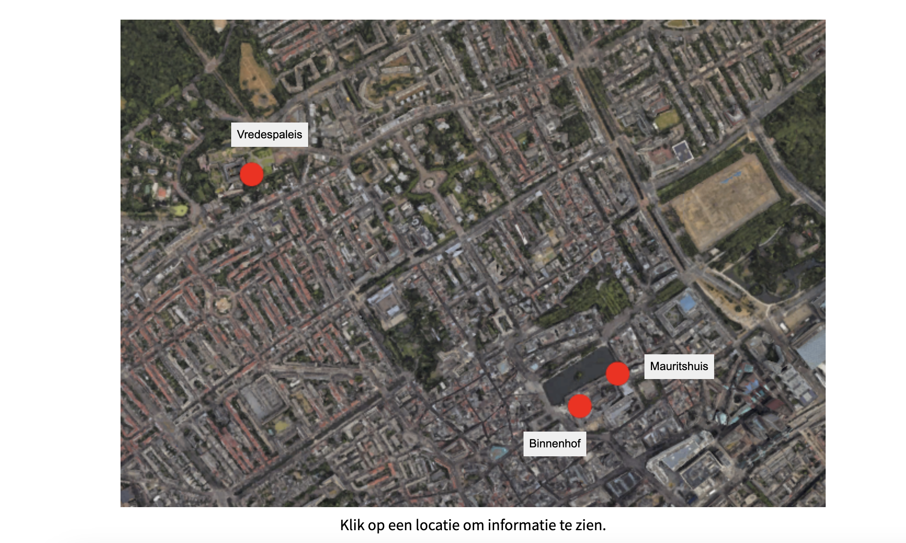

  Een overzicht van de huidige videocarousel:

  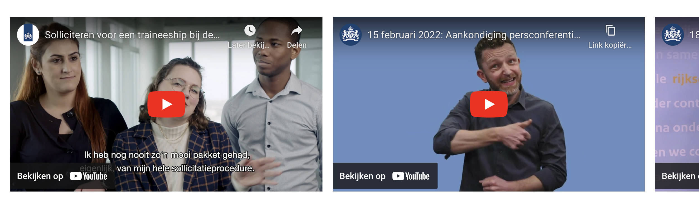

## Aangepaste breakdownschetsen van beide pagina's

Klik hier om mijn aagepaste breakdownschetsen te bekijken

De breakdown van de twee pagina's:

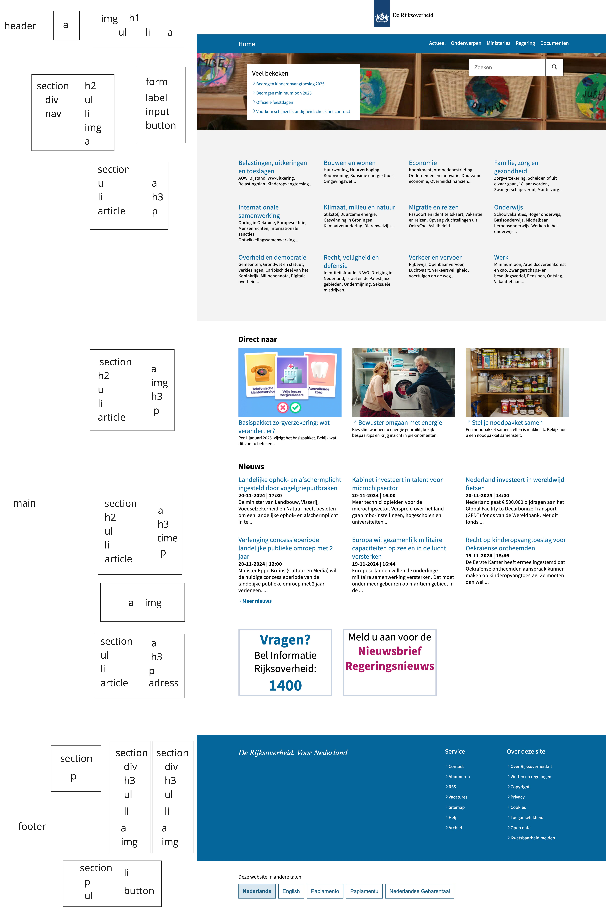

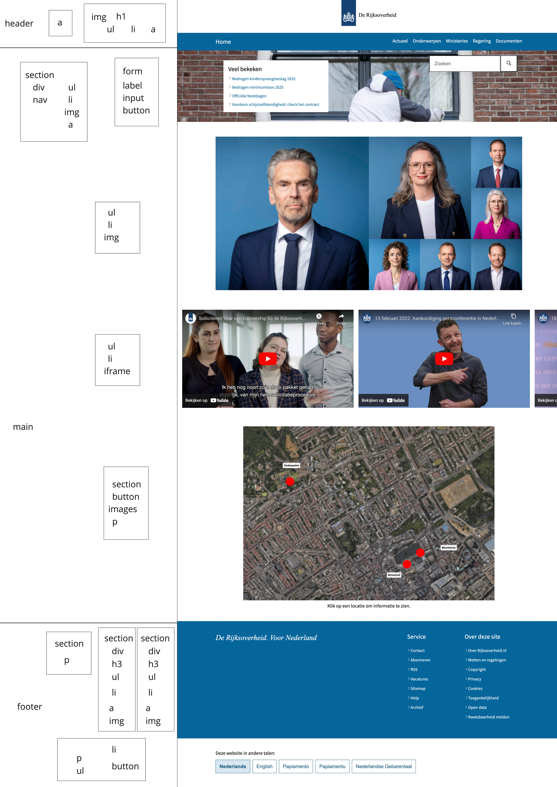

## Eindgesprek (week 5)

  
Bekijk hier mijn voorbereiding en reflectie op het eindgesprek

  Dat waren me nog een paar weken van veel stress en nachtsessies. Uiteindelijk ben ik heel erg trots op het resultaat en kun je zien dat de website bijna identiek is.

  ### Je uitkomst - karakteristieke screenshots:
  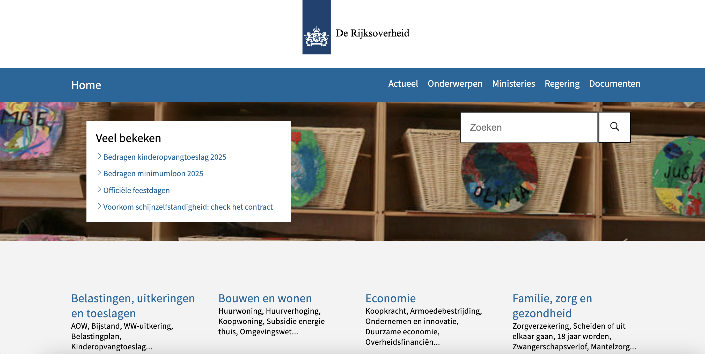
  

  Ook ben ik heel blij dat de website verbeterd is. Ik heb een gloednieuwe pagina toegevoegd en een dark mode gemaakt. Het was best moeilijk om de site beter te maken, aangezien de Rijksoverheid-website alles al goed geregeld had. Uiteindelijk is het me gelukt om een dark mode toe te voegen en de navigatie makkelijker te maken voor iedereen.

  ### Dit ging goed/Heb ik geleerd: 
  Eigenlijk ging alles heel goed en heb ik veel geleerd. Ik heb ontzettend veel uren gemaakt en ben flink vooruitgegaan ten opzichte van vorig jaar. Toen werkten we nooit met grid en kon ik wel wat coderen, maar niet echt goed. Nu heb ik het gevoel dat ik het echt een beetje gemasterd heb. Gestructureerd te werk gaan met een goede voorbereiding en alles goed sorteren zorgt echt voor een hele fijne workflow binnen Visual Studio Code. 

  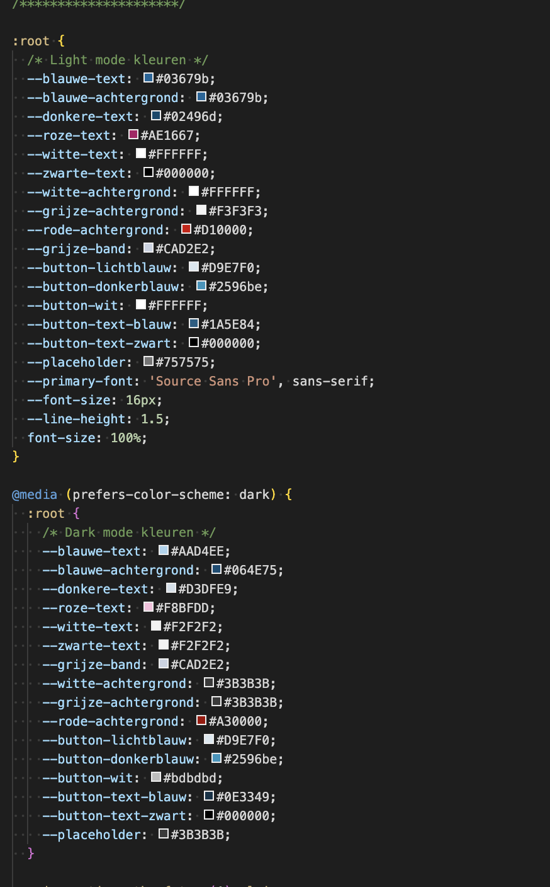
  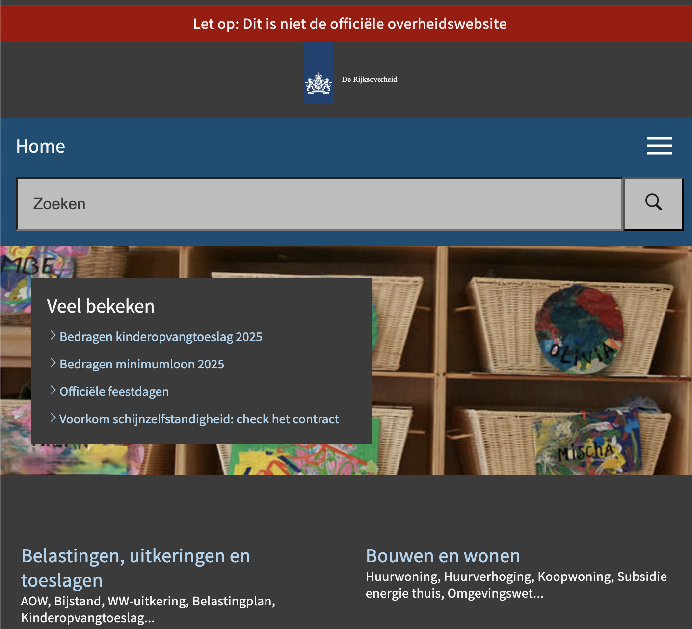

  Hele toffe dingen vind ik bijvoorbeeld het gebruik van custom properties voor consistentie, maar ook dat je daarmee heel makkelijk een dark mode kan maken. Ook vond ik het geweldig om met grid te werken. Dat is echt iets wat we nog niet eerder hebben gedaan en het maakt coderen zoveel makkelijker.

  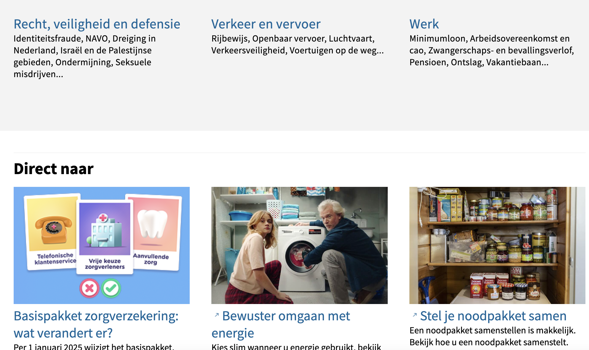
  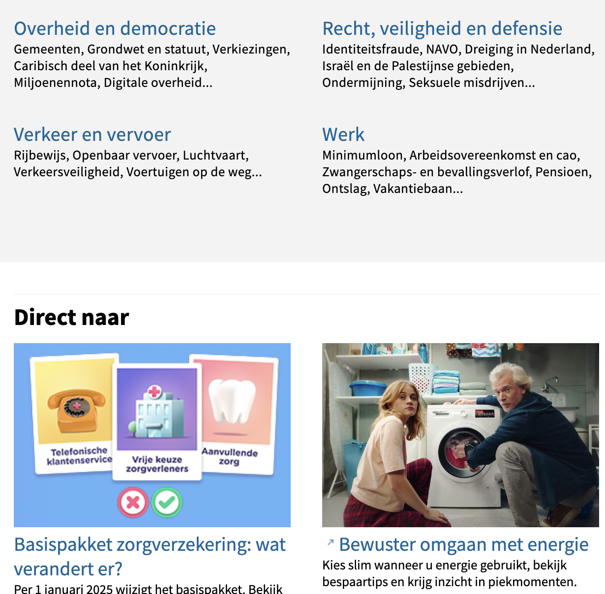

  Daarnaast vond ik het heel leerzaam om te ontdekken hoe je zo min mogelijk classes maakt door slim de HTML-structuur te volgen. Dit maakt je ook meteen beter in CSS!

  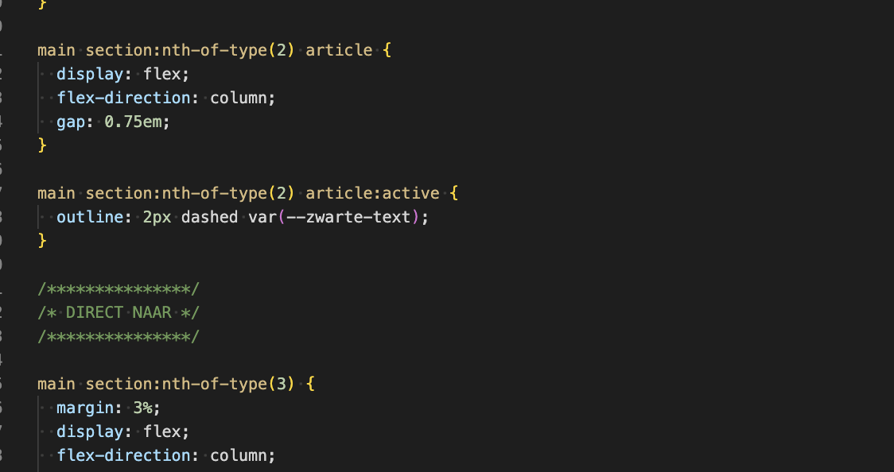

  ### Dit was lastig/Is niet gelukt: 
  Ik ben wel echt tegen een aantal dingen aangelopen. Zo waren er veel momenten dat de code niet werkte of niet het juiste werd aangesproken. Gelukkig bleef ik doorzetten en kwam het uiteindelijk goed. 

  Een voorbeeld van iets moeilijks was het gebruik van sections. Ik had bij Berry geleerd dat je redelijk wat sections kunt gebruiken, maar in mijn project bleek dat vaak niet nodig. Toen ik dit ontdekte, had ik al mijn CSS en JavaScript al geschreven. Dit aanpassen was echt heel frustrerend, maar op veel plekken is het uiteindelijk wel gelukt. Dit neem ik mee als leerpunt voor toekomstige projecten.

  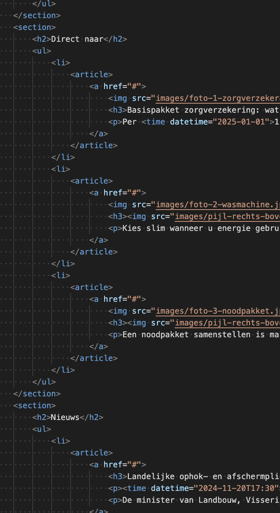

  Ook vond ik het lastig om de juiste HTML-tags te gebruiken. Soms was bijvoorbeeld een heading nodig of moest ik een time-element gebruiken. Dit weet ik nu beter voor de volgende keer en ga ik ook zeker meenemen.

  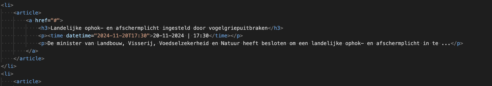

## Bronnenlijst

Klik hierop om alle gebruikte bronnen te bekijken

### Algemeen
Voor sommige delen van de code heb ik mijn eigen aanpassingen en ideeën toegepast, gebaseerd op de tools en informatie uit onderstaande bronnen.

1. Radiotherapiegroep. (z.d.). *Rijksoverheid-logo*. Geraadpleegd in november en december 2024, van [https://www.radiotherapiegroep.nl/rijksoverheid-logo/](https://www.radiotherapiegroep.nl/rijksoverheid-logo/)

2. Rijksoverheid. (z.d.). *Officiële website van de Rijksoverheid*. Geraadpleegd in november en december 2024, van [https://www.rijksoverheid.nl/](https://www.rijksoverheid.nl/)

3. Rijksoverheid. (z.d.). *Actueel*. Geraadpleegd in november en december 2024, van [https://www.rijksoverheid.nl/actueel](https://www.rijksoverheid.nl/actueel)

4. t Hooft, S. (z.d.). HTML- en CSS-code voor responsive design. *CodePen*. Geraadpleegd in november en december 2024, van [https://codepen.io/shooft/pen/MYgKMZp](https://codepen.io/shooft/pen/MYgKMZp)

5. CSS Grid Generator. (z.d.). *Interactie voor grid-layouts*. Geraadpleegd in november en december 2024, van [https://cssgrid-generator.netlify.app/](https://cssgrid-generator.netlify.app/)

6. OpenAI. (z.d.). Kleine aanpassingen en efficiënt maken van code, verzorgd via *ChatGPT*.

### Icons
Icons8. (z.d.). *Black UI icons*. Geraadpleegd in november en december 2024, van [https://icons8.com/icons/collections/9fbzzth4y8icrag6enge--black](https://icons8.com/icons/collections/9fbzzth4y8icrag6enge--black)

### Video's
1. Rijksoverheid. (2024). *Solliciteren voor een traineeship bij de Rijksoverheid?* [Video]. YouTube. Geraadpleegd op 12 december 2024, van [https://www.youtube.com/watch?v=RpICif-_Be8&t=1s](https://www.youtube.com/watch?v=RpICif-_Be8&t=1s)

2. Rijksoverheid. (2024). *Aankondiging persconferentie in Nederlandse Gebarentaal*. [Video]. YouTube. Geraadpleegd op 12 december 2024, van [https://www.youtube.com/watch?v=fwOUZeHFSFk](https://www.youtube.com/watch?v=fwOUZeHFSFk)

3. Rijksoverheid. (2024). *Integrale persconferentie Mark Rutte en Hugo de Jonge*. [Video]. YouTube. Geraadpleegd op 12 december 2024, van [https://www.youtube.com/watch?v=0nJFONxLJYo](https://www.youtube.com/watch?v=0nJFONxLJYo)

4. Rijksoverheid. (2024). *PUUR rookvrij*. [Video]. YouTube. Geraadpleegd op 12 december 2024, van [https://www.youtube.com/watch?v=Ao9YWHytS8I](https://www.youtube.com/watch?v=Ao9YWHytS8I)

